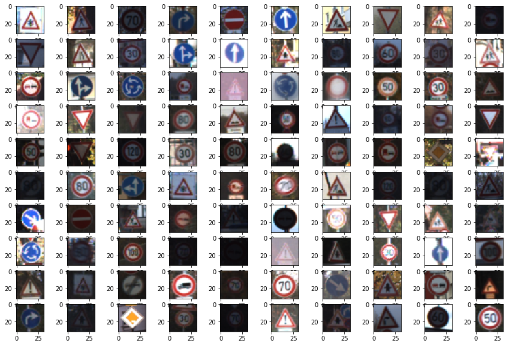
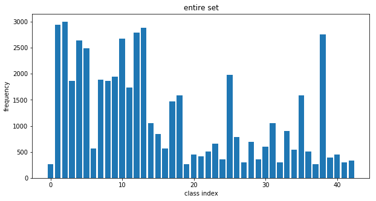
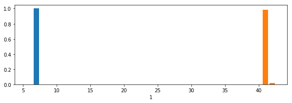

#**Traffic Sign Recognition** 

The goals / steps of this project are the following:
* Load the data set (see below for links to the project data set)
* Explore, summarize and visualize the data set
* Design, train and test a model architecture
* Use the model to make predictions on new images
* Analyze the softmax probabilities of the new images
* Summarize the results with a written report

[//]: # (Image References)

[image1]: ./examples/visualization.jpg "Visualization"
[image2]: ./examples/grayscale.jpg "Grayscaling"
[image3]: ./examples/random_noise.jpg "Random Noise"
[image4]: ./images/1.png "Traffic Sign 1"
[image5]: ./images/2.png "Traffic Sign 2"
[image6]: ./images/3.png "Traffic Sign 3"
[image7]: ./images/4.png "Traffic Sign 4"
[image8]: ./images/5.png "Traffic Sign 5"

## Rubric Points

---
###Data Set Summary & Exploration

####1. Provide a basic summary of the data set. In the code, the analysis should be done using python, numpy and/or pandas methods rather than hardcoding results manually.

I used the pandas library to calculate summary statistics of the traffic
signs data set:

* The size of training set is 34799
* The size of the validation set is 4410
* The size of test set is 12630
* The shape of a traffic sign image is 32x32x3
* The number of unique classes/labels in the data set is 43

####2. Include an exploratory visualization of the dataset.

Here's a random swath of images from the train set, it's easy to see that many images are underexposed and others
seem overly bright. Minimaxing could help (though I ended up not testing that because of time concerns).

Here's a histogram over all classes for the entire dataset as well as individual portions of it. 
The data are extremely unbalanced, but again I got away with getting good accuracy without balancing 
the classes. This is likely because the overall distributions do not change from train to test to 
validation set, so I can get a good accuracy regardless. This is of course a rather artificial solution
to a real problem. I can pass this assignment, but the resulting car won't survive on the streets of 
Bochum.

###Design and Test a Model Architecture

####1. Describe how you preprocessed the image data. What techniques were chosen and why did you choose these techniques? Consider including images showing the output of each preprocessing technique. Pre-processing refers to techniques such as converting to grayscale, normalization, etc. (OPTIONAL: As described in the "Stand Out Suggestions" part of the rubric, if you generated additional data for training, describe why you decided to generate additional data, how you generated the data, and provide example images of the additional data. Then describe the characteristics of the augmented training set like number of images in the set, number of images for each class, etc.)

As a first step, I decided to convert the images to grayscale (by just taking a mean, which isn't a perceptually accurate
greyscale) because the architecture I was using (LeNet5) was designed for greyscale images. 
I also did rudimentary normalization on the images by just shifting the value range to -0.5:0.5. Minimaxing could 
have helped but there was no time.

Data augmentation could have helped to balance classes, but I couldn't get to that.

####2. Describe what your final model architecture looks like including model type, layers, layer sizes, connectivity, etc.) Consider including a diagram and/or table describing the final model.

My final model consisted of the following layers:

| Layer         		|     Description	        					| 
|:---------------------:|:---------------------------------------------:| 
| Input         		| 32x32x1 image   							    | 
| Convolution 5x5     	| 1x1 stride, valid padding, outputs 28x28x12 	|
| RELU					|												|
| Max pooling	      	| 2x2 stride,  outputs 14x14x64 				|
| Convolution 5x5	    | outputs 10x10x32                              |
| RELU					|												|
| Max pooling	      	| 2x2 stride,  outputs 5x5x64 				    |
| Flatten               | outputs 1600                                  |
| Dropout               | 0.5 probablity                                |
| Fully connected		| 1600 to 240 									|
| RELU					|												|
| Fully connected		| 240 to 168 									|
| RELU					|												|
| Fully connected		| 168 to 43 									|
| Softmax				|              									|

This is essentially a modified LeNet. The differences come in layer depths which I increased because
I thought they would help with the higher number of classes.

####3. Describe how you trained your model. The discussion can include the type of optimizer, the batch size, number of epochs and any hyperparameters such as learning rate.

I used a learning rate of 0.001, batch size of 128, and trained for 500 epochs. Originally I was not getting close
to the 95% required accuracy and the behavior looked similar to overfitting. Adding a dropout layer fixed that.

####4. Describe the approach taken for finding a solution and getting the validation set accuracy to be at least 0.93. Include in the discussion the results on the training, validation and test sets and where in the code these were calculated. Your approach may have been an iterative process, in which case, outline the steps you took to get to the final solution and why you chose those steps. Perhaps your solution involved an already well known implementation or architecture. In this case, discuss why you think the architecture is suitable for the current problem.

My final model results were:
* training set accuracy of ?
* validation set accuracy of ? 
* test set accuracy of ?

If an iterative approach was chosen:
* What was the first architecture that was tried and why was it chosen?

  I tried standard LeNet modified to accept a color image, this was simple but did not work well

* What were some problems with the initial architecture?

  Proabaly too small a network for the problem size

* How was the architecture adjusted and why was it adjusted? Typical adjustments could include choosing a different model architecture, adding or taking away layers (pooling, dropout, convolution, etc), using an activation function or changing the activation function. One common justification for adjusting an architecture would be due to overfitting or underfitting. A high accuracy on the training set but low accuracy on the validation set indicates over fitting; a low accuracy on both sets indicates under fitting.

  I changed the depth of some of the layers, added more filters and larger fully connected layers.

* Which parameters were tuned? How were they adjusted and why?

  Dropout percentage, number of epochs, and learning rate, mostly to overcome overfitting.

* What are some of the important design choices and why were they chosen? For example, why might a convolution layer work well with this problem? How might a dropout layer help with creating a successful model?

  A convolutional layer works well with this problem because this is an image classification problem and image
  classification problems have historically worked better with convolution rather than flattening the image.
  Dropout was possibly the most important choice to keep the model from overfitting.

If a well known architecture was chosen:
* What architecture was chosen?

  LeNet but modified.

* Why did you believe it would be relevant to the traffic sign application?

  It's a standard CNN built for classification of a small number of categories, so, yeah.

* How does the final model's accuracy on the training, validation and test set provide evidence that the model is working well?

It honestly doesn't. The data are oddly imbalanced and I don't believe I can make good real world statements with them. 
I would not sit in a car using this model.
 

###Test a Model on New Images

####1. Choose five German traffic signs found on the web and provide them in the report. For each image, discuss what quality or qualities might be difficult to classify.

Here are five German traffic signs that I found on the web:

![alt text][image4] ![alt text][image5] ![alt text][image6] 
![alt text][image7] ![alt text][image8]

####2. Discuss the model's predictions on these new traffic signs and compare the results to predicting on the test set. At a minimum, discuss what the predictions were, the accuracy on these new predictions, and compare the accuracy to the accuracy on the test set (OPTIONAL: Discuss the results in more detail as described in the "Stand Out Suggestions" part of the rubric).

Here are the results of the prediction:

| Image			        |     Prediction	        					| 
|:---------------------:|:---------------------------------------------:| 
| Stop Sign      		| Stop sign   									| 
| Children Crossing     | Children Crossing     						|
| 100 km/h	      		| 80km/h speed limit    		 				|
| Roundabout mandatory  | Priority Road                                 |
| Double curve          | Beware of ice/snow                            |

The model gets three wrong, the first incorrect is understandable (even I can't distinguish speed limits well in a 
32x32 image). The roundabout getting confused with priority road is weird, as the latter is a diamond shape. 
The double curve getting confused with the ice/snow sign is understandable as well as they are both triangular.

####3. Describe how certain the model is when predicting on each of the five new images by looking at the softmax probabilities for each prediction. Provide the top 5 softmax probabilities for each image along with the sign type of each probability. (OPTIONAL: as described in the "Stand Out Suggestions" part of the rubric, visualizations can also be provided such as bar charts)

Note that the NN was extremely confident about the correct classifications.

Correct Label: Speed limit (100km/h)
Label: Speed limit (80km/h), Prob: 0.6738093495368958
Label: No passing for vehicles over 3.5 metric tons, Prob: 0.17281897366046906
Label: Speed limit (100km/h), Prob: 0.1146104633808136
Label: Speed limit (60km/h), Prob: 0.024198275059461594
Label: Speed limit (50km/h), Prob: 0.005034067202359438

Correct Label: Children crossing
Label: Children crossing, Prob: 0.9999971389770508
Label: Right-of-way at the next intersection, Prob: 1.927884568431182e-06
Label: Bicycles crossing, Prob: 4.875794274994405e-07
Label: Beware of ice/snow, Prob: 3.5585904356594256e-07
Label: Dangerous curve to the right, Prob: 1.520764953966136e-07

Correct Label: Roundabout mandatory
Label: Priority road, Prob: 0.8955790996551514
Label: Roundabout mandatory, Prob: 0.09142322838306427
Label: End of all speed and passing limits, Prob: 0.012944108806550503
Label: End of no passing by vehicles over 3.5 metric tons, Prob: 2.1706375264329836e-05
Label: Stop, Prob: 8.466480721835978e-06

Correct Label: Stop
Label: Stop, Prob: 0.9992644190788269
Label: Turn left ahead, Prob: 0.0006675992044620216
Label: Keep right, Prob: 6.7940927692689e-05
Label: No entry, Prob: 1.2167087959369383e-07
Label: Speed limit (30km/h), Prob: 7.903548926435633e-09

Correct Label: Double curve
Label: Beware of ice/snow, Prob: 0.7856820821762085
Label: Children crossing, Prob: 0.2060038447380066
Label: Bicycles crossing, Prob: 0.004547078628093004
Label: Right-of-way at the next intersection, Prob: 0.0032785004004836082
Label: Dangerous curve to the right, Prob: 0.0004777271533384919

A visualization of this is given below for the first case:

### (Optional) Visualizing the Neural Network (See Step 4 of the Ipython notebook for more details)
####1. Discuss the visual output of your trained network's feature maps. What characteristics did the neural network use to make classifications?

Ran out of time.
